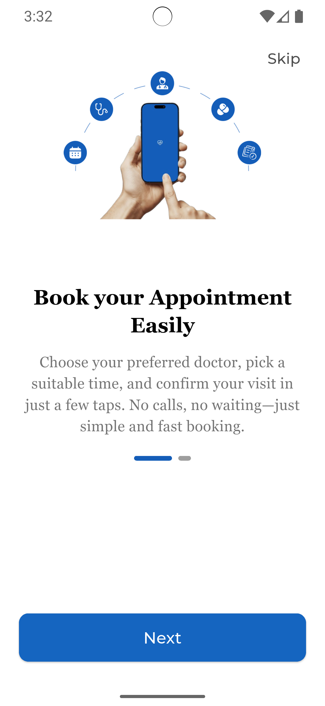
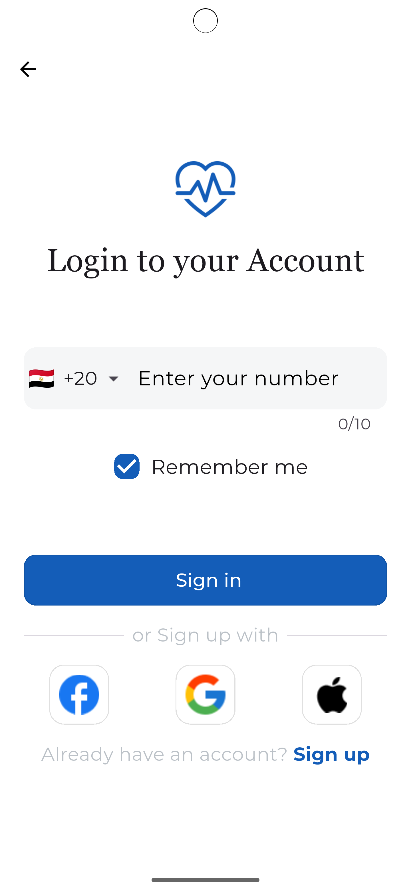
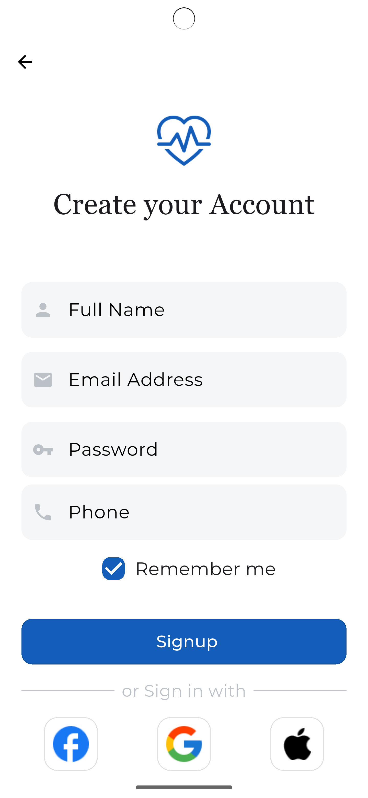
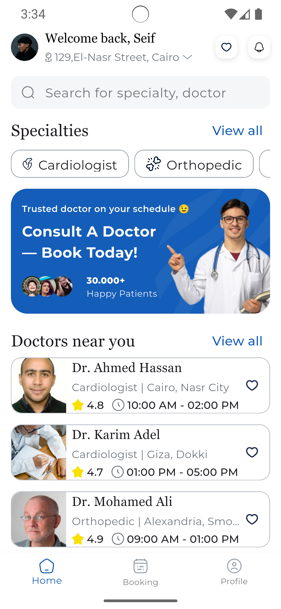
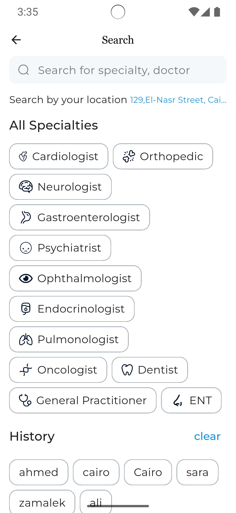
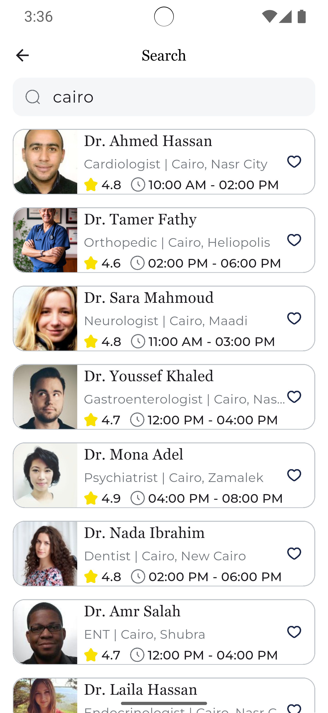
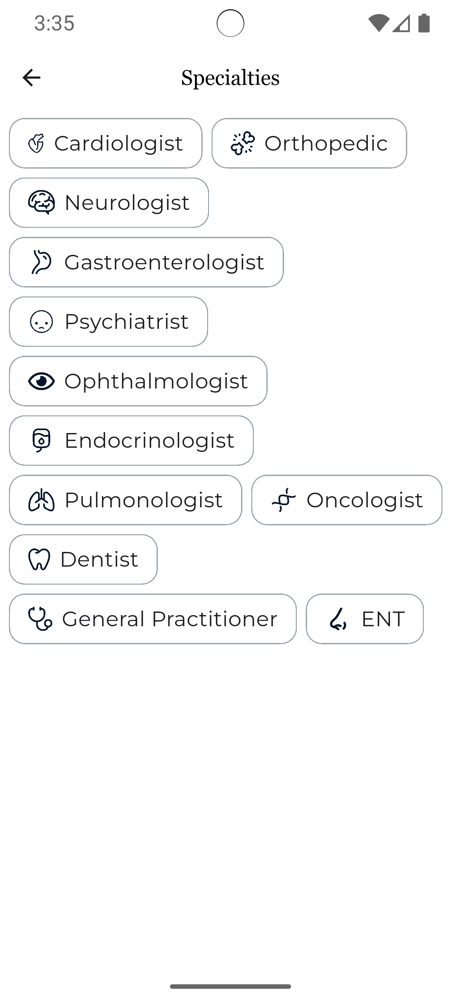
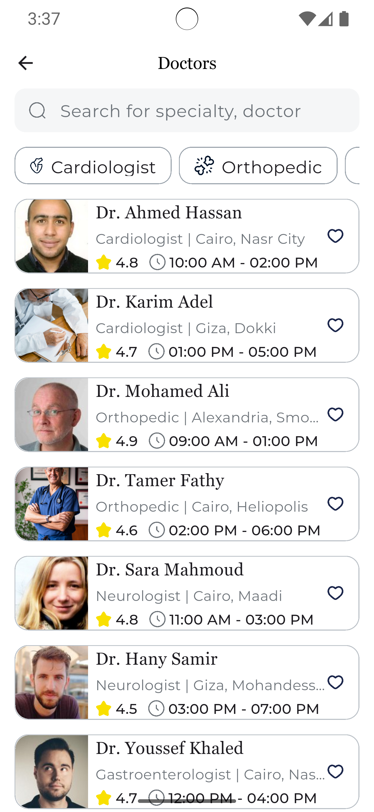
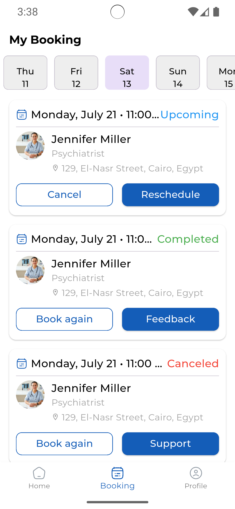
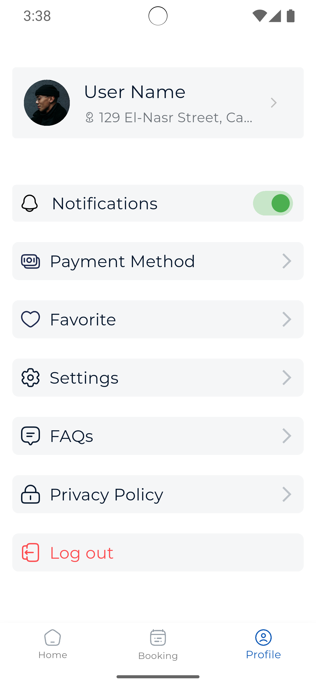

# Mobile Booking Online Doctor 🏥

A comprehensive Flutter mobile application for booking doctor appointments with an intuitive interface and powerful features.

## 📱 About The Project

Mobile Booking Online Doctor is a full-featured healthcare application that allows users to search for doctors by specialty, book appointments, manage their profile, and access various healthcare services. The app provides a seamless experience for patients to connect with healthcare providers.

## 📱 Screenshots

<p align="center">
  
  
  
  
  
</p>

<p align="center">
  
  
  
  
  
</p>

<p align="center">
  
    
    
    
</p>


<p align="center">
  
  
  
  
</p>

## ✨ Key Features

### 🔐 Authentication & Onboarding
- Smooth onboarding experience with informative screens
- Multiple sign-in options (Email, Phone, Social Media)
- OTP verification for phone and email
- Password reset functionality
- Secure token-based authentication

### 🏠 Home & Discovery
- Browse doctors by specialty
- View nearby doctors with location-based search
- Interactive doctor cards with ratings and availability
- Search functionality with history tracking
- Filter doctors by various criteria

### 🔍 Search & Specialties
- Advanced search with real-time results
- Search history management
- Browse all medical specialties
- Specialty-specific doctor listings
- Location-based doctor discovery

### 👨‍⚕️ Doctor Information
- Detailed doctor profiles with experience and qualifications
- Patient reviews and ratings
- Doctor availability and working hours
- Hospital/clinic information
- Price information per consultation

### 📅 Appointment Management
- Book appointments with preferred doctors
- Calendar view for available time slots
- Appointment confirmation and tracking
- Upcoming, completed, and cancelled appointments
- Appointment rescheduling and cancellation

### 💳 Payment Integration
- Multiple payment methods (Credit/Debit cards, Mobile wallets)
- Secure payment processing
- Payment method management
- Support for Visa, MasterCard, Apple Pay, and PayPal

### ⭐ Reviews & Ratings
- Rate doctors after appointments
- Write detailed reviews
- View aggregated ratings
- Review management

### 💙 Favorites
- Save favorite doctors for quick access
- Separate lists for doctors and hospitals
- Easy favorite management
- Quick booking from favorites

### 👤 Profile Management
- Complete profile editing
- Personal information management
- Profile picture upload
- Birthday selection
- Location management

### ⚙️ Settings & Privacy
- Password management
- Account settings
- Privacy policy
- FAQs section
- Account deletion option

## 🏗️ Architecture & Tech Stack

### Architecture Pattern
- **Clean Architecture** with separation of concerns
- **BLoC/Cubit** for state management
- **Repository Pattern** for data layer abstraction
- **Dependency Injection** using GetIt

### Project Structure
```
lib/
├── core/
│   ├── api_client/         # API client configuration
│   ├── constant/           # App constants
│   ├── di/                 # Dependency injection setup
│   ├── error/              # Error handling
│   ├── helpers/            # Helper utilities
│   ├── network/            # Network layer
│   ├── routes/             # App routing
│   ├── service/            # Core services (Auth, API)
│   ├── theming/            # Theme & styling
│   ├── token/              # Token management
│   ├── validators/         # Input validators
│   └── widgets/            # Reusable widgets
├── features/
│   ├── auth/               # Authentication features
│   ├── home/               # Home screen
│   ├── search/             # Search functionality
│   ├── booking/            # Appointment booking
│   ├── doctor_details/     # Doctor profile
│   ├── profile/            # User profile
│   ├── notifications/      # Notifications
│   ├── favorite/           # Favorites
│   ├── reviews/            # Reviews & ratings
│   ├── payment/            # Payment integration
│   ├── settings/           # App settings
│   └── specialties/        # Medical specialties
└── main.dart
```

### Technologies & Packages

#### Core Dependencies
- **flutter_bloc** (^9.1.1) - State management
- **get_it** (^8.2.0) - Dependency injection
- **dio** (^5.4.0) - HTTP client
- **dartz** (^0.10.1) - Functional programming

#### UI & Styling
- **flutter_screenutil** (^5.9.3) - Responsive design
- **flutter_svg** (^2.2.0) - SVG support
- **google_fonts** (^6.3.0) - Custom fonts
- **smooth_page_indicator** (^1.1.0) - Page indicators

#### Storage & Cache
- **hive** (^2.2.3) - Local database
- **hive_flutter** (^1.1.0) - Hive Flutter integration
- **shared_preferences** (^2.5.3) - Simple key-value storage

#### Forms & Input
- **pin_code_fields** (^8.0.1) - OTP input
- **intl_phone_field** (^3.2.0) - Phone number input

## 🚀 Getting Started

### Prerequisites
- Flutter SDK (3.8.1 or higher)
- Dart SDK
- Android Studio / VS Code
- iOS development setup (for iOS builds)

### Installation

1. **Clone the repository**
```bash
git clone https://github.com/ahmedasaber/mobile_booking_online_doctor.git
cd mobile_booking_online_doctor
```

2. **Install dependencies**
```bash
flutter pub get
```

3. **Generate required files**
```bash
flutter pub run build_runner build --delete-conflicting-outputs
```

4. **Run the app**
```bash
flutter run
```

## 🔧 Configuration

### API Configuration
Update the base URL in relevant files:
```dart
// lib/core/di/dependency_injection.dart
Sting baseUrl = 'YOUR_API_BASE_URL';
```

### Authentication Token
The app uses Bearer token authentication stored securely using the `AuthManager` service.

## 📦 Key Dependencies Explanation

### State Management (BLoC/Cubit)
- **Why**: Predictable state management with clear separation
- **Usage**: Used across all features for managing UI state

### Dependency Injection (GetIt)
- **Why**: Loose coupling and easy testing
- **Usage**: Service locator pattern for all dependencies

### Local Storage (Hive)
- **Why**: Fast, lightweight NoSQL database
- **Usage**: Favorites, search history, offline data

### HTTP Client (Dio)
- **Why**: Powerful HTTP client with interceptors
- **Usage**: All API communications with error handling

## 🎨 UI/UX Features

- **Responsive Design**: Adapts to different screen sizes
- **Custom Fonts**: Montserrat and Georgia for better readability
- **Smooth Animations**: Page transitions and loading states
- **Intuitive Navigation**: Bottom navigation with clear hierarchy
- **Accessibility**: High contrast, readable fonts, proper spacing

## 🔒 Security Features

- **Token-based Authentication**: Secure API communication
- **Secure Storage**: Sensitive data encrypted locally
- **Input Validation**: All forms validated before submission
- **Error Handling**: Graceful error handling throughout the app

## 🧪 Testing

```bash
# Run unit tests
flutter test

# Run integration tests
flutter test integration_test

# Run with coverage
flutter test --coverage
```


## 🤝 Contributing

Contributions are welcome! Please feel free to submit a Pull Request.

1. Fork the Project
2. Create your Feature Branch (`git checkout -b feature/AmazingFeature`)
3. Commit your Changes (`git commit -m 'Add some AmazingFeature'`)
4. Push to the Branch (`git push origin feature/AmazingFeature`)
5. Open a Pull Request


## 👥 Contact

Ahmed Ashraf - ahmeda.saber22@gmail.com

## 🙏 Acknowledgments

- Flutter team for the amazing framework
- All package contributors
- Design inspiration from modern healthcare apps

---

**Note**: This project is for educational/demonstration purposes. Ensure proper security measures and compliance with healthcare regulations (HIPAA, GDPR, etc.) before using in production.